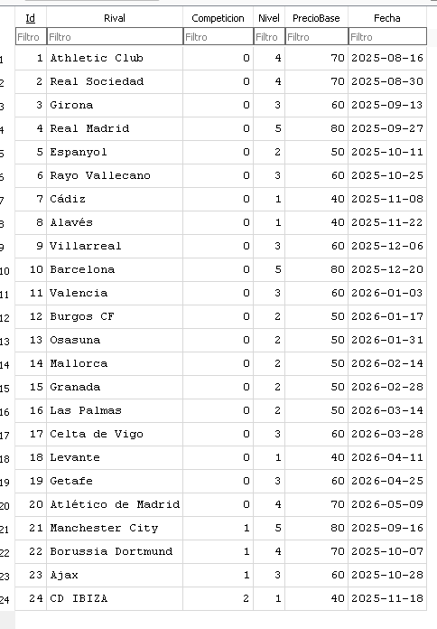
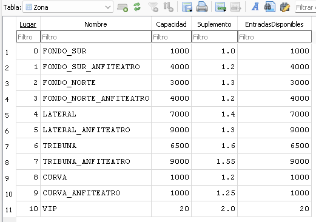
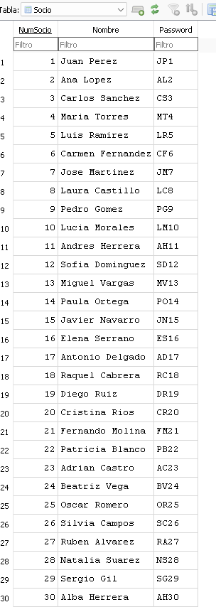
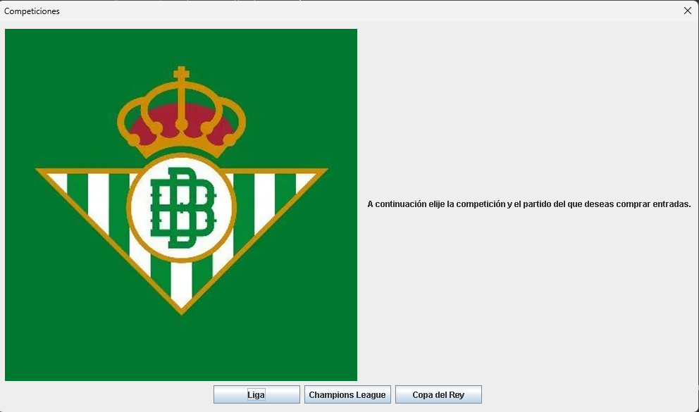
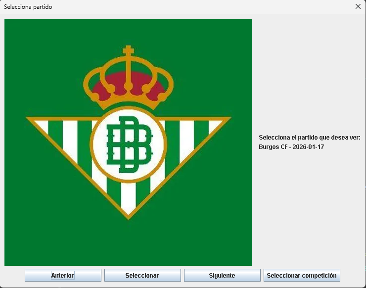
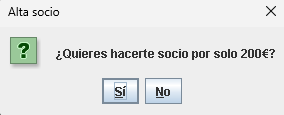
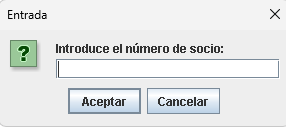
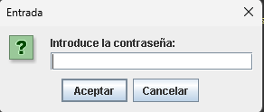
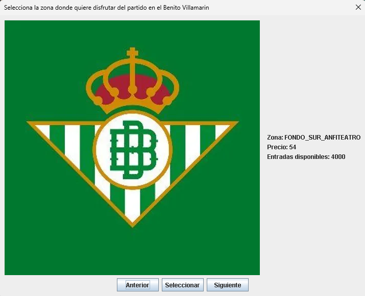
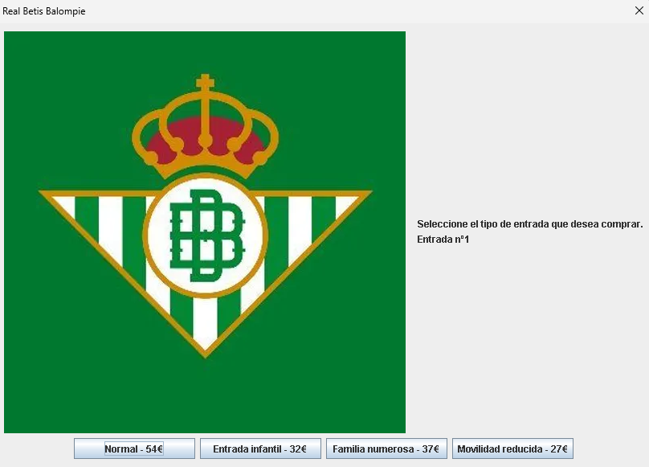

# ⚽ Gestión de Entradas - Real Betis Balompié

Sistema de gestión de venta de entradas para partidos de fútbol, desarrollado en **Java**. Permite la gestión de socios, visualización de partidos por competición y venta de localidades con generación automática de tickets.

## 📋 Descripción

Este proyecto fue desarrollado como parte del portafolio académico de 1º de Desarrollo de Aplicaciones (DAM/DAW). Simula un entorno real de venta de entradas donde los usuarios pueden:
* Visualizar el calendario de partidos (Liga, Champions, Copa).
* Seleccionar zonas del estadio (con precios dinámicos según visibilidad).
* Aplicar descuentos automáticos (Socios, Familia Numerosa, etc.).
* Generar tickets de compra en formato `.txt`.

> **Nota:** El proyecto utiliza persistencia de datos local mediante **SQLite** para facilitar su portabilidad y ejecución sin necesidad de configurar servidores de bases de datos externos.

## 🛠️ Tecnologías Utilizadas

* **Lenguaje:** Java (JDK 17+)
* **Interfaz:** Java Swing (JOptionPane para diálogos interactivos)
* **Base de Datos:** SQLite (JDBC)
* **Herramientas:** Eclipse IDE

## 🚀 Instalación y Ejecución

1.  Clonar el repositorio o descargar el código.
2.  Importar el proyecto en Eclipse (o tu IDE favorito).
3.  Asegurarse de que el driver `sqlite-jdbc.jar` está añadido al *Build Path*.
4.  Ejecutar la clase `Principal.java`.
    * *La base de datos se generará automáticamente en la raíz del proyecto si no existe.*

## ⚙️ Características Técnicas Destacadas

* **Gestión de Persistencia:** Uso de JDBC para operaciones CRUD (Crear, Leer, Actualizar) sobre entradas y disponibilidad de aforo.
* **Lógica de Negocio:**
    * Control de aforo en tiempo real (resta de entradas disponibles por zona).
    * Algoritmo de precios dinámicos según el nivel del rival y la zona del estadio.
* **Manejo de Archivos:** Generación de tickets físicos en carpetas locales.

## 📝 Nota del Desarrollador

Este proyecto representa mis primeros pasos en la programación orientada a objetos y bases de datos relacionales. Aunque actualmente utilizaría arquitecturas como MVC o patrones de diseño más avanzados, he decidido mantener la estructura original para mostrar la evolución en mi aprendizaje.

Se han implementado soluciones creativas para la gestión de tipos de datos y la integridad referencial en un entorno de aprendizaje inicial.

## 📸 Galería del Proyecto

### 1. Backend y Persistencia de Datos (SQLite)
Antes de iniciar la aplicación, podemos verificar que los datos se cargan correctamente desde la base de datos local.

  
  

  

> *Vista de las tablas 'Partido', 'Zona' y 'Socio' con los datos persistentes.*

---

### 2. Flujo de Usuario: Selección de Evento
El usuario navega por las competiciones y selecciona el partido deseado.

  
  

---

### 3. Lógica de Negocio: Gestión de Socios
El sistema detecta si el usuario es socio para aplicar descuentos. Si no lo es, ofrece la posibilidad de registrarse.

  
  
  

> *Validación de credenciales contra la base de datos de Socios.*

---

### 4. Proceso de Compra
Selección de localidad y tarifa. El aforo se actualiza en tiempo real.

  
  

---

### 5. Resultado Final
Generación automática del ticket de compra en formato texto.

  

---
*Desarrollado con 💚 y mucho Betis.*
